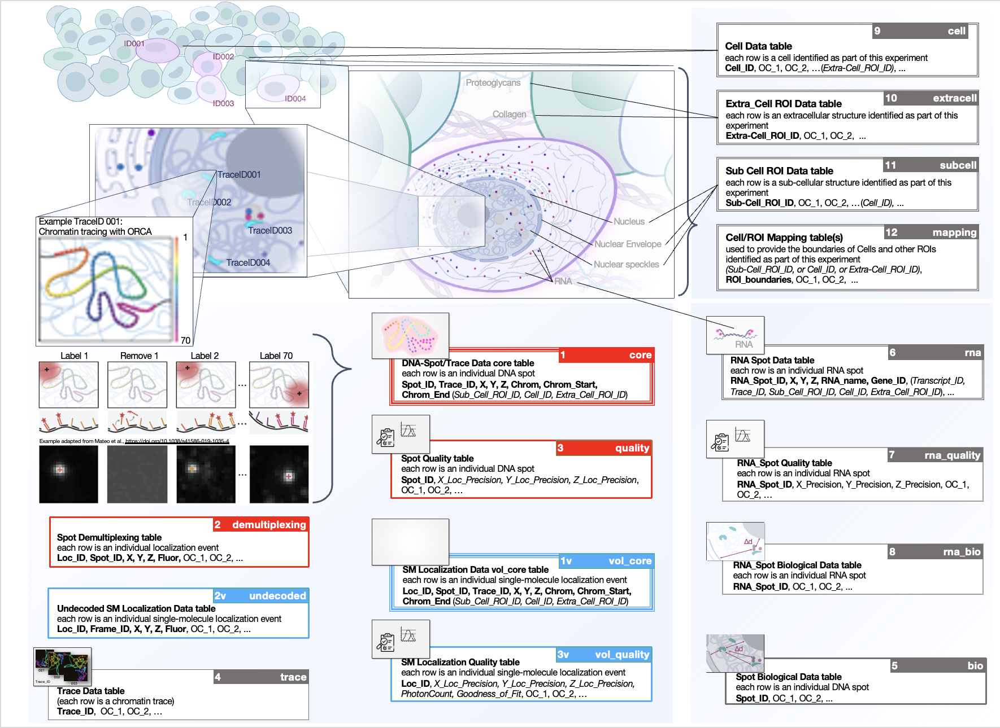

## FISH Omics Format (FOF) - Chromatin Tracing (CT)

This repository describes the **FISH Omics Format - Chromatin Tracing (FOF-CT)**, a community data format designed for capturing and exchanging the results of both **ball-and-stick** and **volumetric** Chromatin Tracing experiments [(Dekker et al., 2023)](https://doi.org/10.1016/j.molcel.2023.06.018) that was initially produced within the context of the [4D Nucleome (4DN)](https://www.4dnucleome.org) project.

The format consists of a series of **15 tables** with different degrees of requirements (see below). 

- **12 tables** are shared among **FOF-bas-CT** and **FOF-vol-CT**.
- **3 additional tables** are specific for **FOF-vol-CT**.

The full list of tables and instructions on how to use them can be found at: https://fish-omics-format.readthedocs.io/.

The image below provides a schematic representation of 15 tables composing the FOF-CT. FOF-CT is a modular format designed to capture Chromatin Tracing data from two experiment modalities: **Ball-and-Stick (bas)** and **Volumetric (vol)**. Tables are represented as color-coded boxes (**3 red** bas primary tables; **3 blue** vol-specific tables; **9 grey** tables shared across both modalities). The figure indicates each table's index number and short name in the upper-right corner. In addition, depicted is whether tables are **required** (**triple line**), *conditionally required* (*double line*), recommended (thick single line) or optional (single line). (Figure credit: Sarah Aufmkolk).

