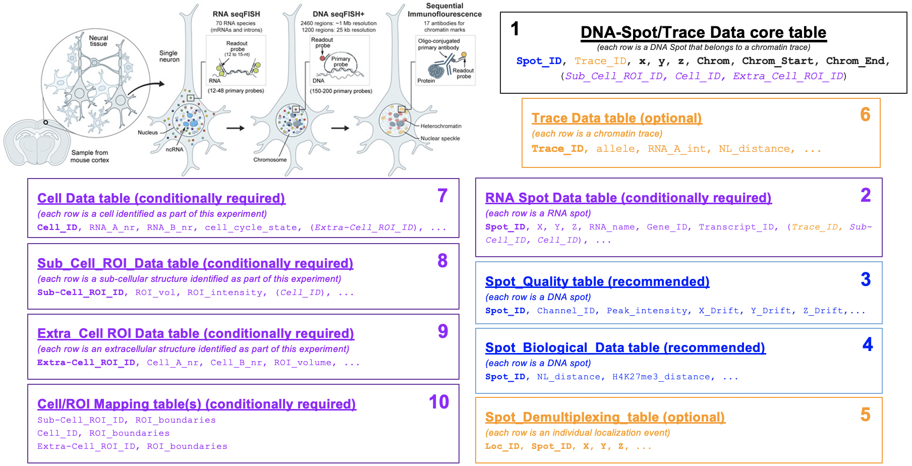

Introduction
============

A key output of the 4D Nucleome (4DN) project is the open publication of
datasets related to the structure of the human cell nucleus and the genome,
within. Recent years have seen a rapid expansion of FISH-omics methods,
which quantify the spatial organization of DNA, RNA and protein in the
cell and provide expanded understanding of how higher-order chromosome
structure relates to transcriptional activity and cell development.
Despite this progress, FISH-based image-data are not yet routinely made
publicly available upon publication because of the lack of common
specifications for data exchange. This challenge is experienced across
the bioimaging community, as a result a solution built, tested and
proven in 4DN can have a wide impact all over the world.

This document describes the **4DN FISH Omics Format - Chromatin
Tracing (FOF-CT)**, a community data format designed for capturing and
exchanging the results of chromosome imaging experiments produced within
the context of the 4D Nucleome project. FOF-CT is directly compatible
with several FISH omics techniques including, but not limited to,
Optical Reconstruction of Chromatin Architecture (`ORCA <https://doi.org/10.1038/s41596-020-00478-x>`_), Multiplexed Imaging of
Nucleome Architectures (`MINA <https://doi.org/10.1038/s41596-021-00518-0>`_), `Hi-M <https://doi.org/10.1016/j.molcel.2019.01.011>`_, DNA Sequential Fluorescence In Situ Hybridization (`seqFISH+ <https://doi.org/10.1038/s41586-019-1049-y>`_), Oligonucleotide Fluorescent In Situ Sequencing (`OligoFISSEQ <https://doi.org/10.1038/s41592-020-0890-0>`_), DNA Multiplexed error-robust fluorescence *in situ* hybridization (`DNA-MERFISH <https://doi.org/10.1016/j.cell.2020.07.032>`_), and *In-situ* Genomic Sequencing (`IGS <https://doi.org/10.1126/science.aay3446>`_). In addition, the format is designed to be consistent with planned future
extensions that will encompass single-molecule localization methods for
volumetric imaging, such as OligoSTORM and OligoDNA-PAINT.

In chromatin tracing experiments, polymer tracing algorithms are used to
string together the localization of individual DNA bright Spots to
reconstruct the three-dimensional (3D) path of chromatin fibers. Thus,
the format is organized around multiple tables. The core of the format
consists of a Spot/Trace table that defines chromatin Traces as
ensembles of individual DNA-FISH bright Spot localizations.

Additional tables support the integration of this core with additional
properties such as quality metrics, physical coordinates placing the
Spot/Trace in the context of cellular space, multiplexed `RNA-FISH results <https://doi.org/10.1073/pnas.1912459116>`_ and with additional
data that is better captured at the global Trace (e.g., expression level
of nascent RNA transcripts associated with a given Trace or overall
localization of the Trace with respect to cellular or nuclear
landmarks), Cell (e.g., boundaries and volume), sub-cellular Region of
Interest (ROI; e.g., Nuclear feature or Nucleolus), or extracellular ROI
(e.g., Tissue) level.

  Figure 1: Schematic representation of 10 tables composing the Fish Omics Format for Chromatin Tracing.

Tables
======

.. list-table::
  :header-rows: 1

  * - Number
    - Extended Name
    - Short Name
    - Requirement Level
  * - 1
    - :ref:`core`
    - core
    - required
  * - 2
    - :ref:`rna`
    - rna
    - conditionally required
  * - 3
    - :ref:`quality`
    - quality
    - recommended
  * - 4
    - :ref:`bio`
    - bio
    - recommended
  * - 5
    - :ref:`demultiplexing`
    - demultiplexing
    - optional
  * - 6
    - :ref:`trace`
    - trace
    - optional
  * - 7
    - :ref:`cell`
    - cell
    - conditionally required
  * - 8
    - :ref:`subcell`
    - subcell
    - conditionally required
  * - 9
    - :ref:`extracell`
    - extracell
    - conditionally required
  * - 10
    - :ref:`mapping`
    - mapping
    - conditionally required
