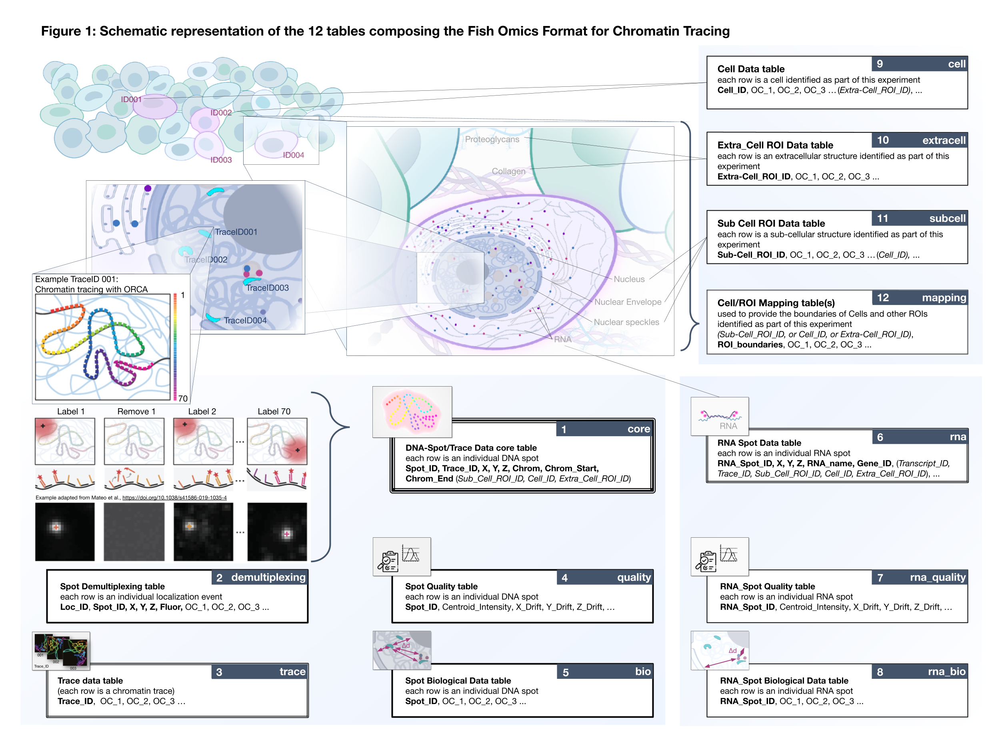

Introduction
============

.. contents::
Background
----------
A key output of the (`4D Nucleome <https://www.4dnucleome.org/>`_) project is the open release of datasets that measure the spatial arrangement of DNA, RNA, and proteins within the human cell nucleus, thereby uncovering the functional dynamics of the genome in three dimensions and over time (referred to as 4D).

FISH Omics techniques description
^^^^^^^^^^^^^^^^^^^^^^^^^^^^^^^^^
Specific genomic sequences can be visualized by fluorescence in situ hybridization (FISH) using fluorescently labeled DNA probes, and their location in individual cells can be imaged using either traditional microscopy techniques (e.g., widefield or confocal)or super-resolution microscopy as reviewed by (`Fraser et al. <https://doi.org/10.1128/MMBR.00006-15>`_) and (`Jerkovic and Cavilli <https://doi.org/10.1038/s41580-021-00362-w>`_)

As a logical evolution of more traditional techniques allow the detection of multiple and ideally all DNA locations across the genome (see recent reviews: `Jercovic and Cavalli <https://doi.org/10.1038/s41580-021-00362-w>`_, `Boettiger and Murphy <https://doi.org/10.1016/j.tig.2019.12.010>`_, `Hu and Wang <https://doi.org/10.1016/j.tcb.2020.10.006>`_, `Maslova and Krasikova <https://doi.org/10.3389/fcell.2021.753097>`_, 
`Zhuang <https://doi.org/10.1038/s41592-020-01037-8>`_, and `Bouwman et al. <https://doi.org/10.1016/j.molcel.2023.06.018>`_).

Collectively these technologies can be called interchangeably **multiplexed FISH** or **FISH omics**, which emphasize the visualization of multiple or ideally all genomic targets, respectively. These methods provide an expanded understanding of how higher-order chromosome structure relates to transcriptional activity and cell development.

A variety of protocols have been developed in the past few years, and they can be divided into two main categories called respectively **ball-and-stick** or **volumetric** chromatin tracing, depending on whether the targeted genomic segment is visualized as a **centroid** (i.e., fitting the imaged spot of a detected fluorescent signal) or a **cloud of single-molecule localizations** (i.e., often rendered as a volume; see Figure 2 in `Dekker et al. <https://doi.org/10.1016/j.molcel.2023.06.018>`_).

FISH Omics Format rationale
^^^^^^^^^^^^^^^^^^^^^^^^^^^
Despite the advances described in the previous section, FISH-based image-data is not yet routinely made publicly available upon publication because of the sheer size of the data and the lack of community specifications for data exchange. This challenge is experienced across the bioimaging community, as a result a solution built, tested and proven in 4DN can have a wide impact all over the world.

This document describes the **4DN FISH Omics Format - Chromatin
Tracing (FOF-CT)**, a community data format designed for capturing and
exchanging the results of chromosome imaging experiments produced within
the context of the 4D Nucleome project and beyond. 

FOF-CT is directly compatible with several **ball-and-stick** FISH-omics techniques including, but not limited to, Optical Reconstruction of Chromatin Architecture (`ORCA <https://doi.org/10.1038/s41596-020-00478-x>`_), Multiplexed Imaging of
Nucleome Architectures (`MINA <https://doi.org/10.1038/s41596-021-00518-0>`_), `Hi-M <https://doi.org/10.1016/j.molcel.2019.01.011>`_, DNA Sequential Fluorescence In Situ Hybridization (`seqFISH+ <https://doi.org/10.1038/s41586-019-1049-y>`_), Oligonucleotide Fluorescent In Situ Sequencing (`OligoFISSEQ <https://doi.org/10.1038/s41592-020-0890-0>`_), DNA Multiplexed error-robust fluorescence *in situ* hybridization (`DNA-MERFISH <https://doi.org/10.1016/j.cell.2020.07.032>`_), and *In-situ* Genomic Sequencing (`IGS <https://doi.org/10.1126/science.aay3446>`_). 

In addition, the format is designed to be consistent with the ongoing development of extensions that will encompass **volumetric** chromatin tracing methods, such as OligoSTORM and OligoDNA-PAINT 
(`Nir et al. <https://doi.org/10.1371/journal.pgen.1007872>`_, `Luppino et al. <https://doi.org/10.1038/s41588-020-0647-9>`_, `Belivau et al. <https://doi.org/10.1007/978-1-4939-7265-4_19>`_, `Bintu et al. <https://doi.org/10.1126/science.aau1783>`_).

.. note:: FOF-CT is designed to work with both unmodified genomes and genomes containing INSERTIONS or DELETIONS. For guidance on capturing genomic variants using FOF-CT, refer to the instructions in :ref:core, and include a description of the custom build using the Variant Call Format (VCF) as outlined in :ref:`VCF-reference-label`.

FISH Omics Format summary
^^^^^^^^^^^^^^^^^^^^^^^^^
In chromatin tracing experiments, polymer tracing algorithms are used to
string together the localization of individual DNA bright Spots to
reconstruct the three-dimensional (3D) path of chromatin fibers. 

In order to capture chromatin traces as well as additional metrics captured during the course of the experiment, the FOF-CT format is organized around multiple tables.

The root of the format consists of the **mandatory** :ref:`core` table that defines Chromatin Traces as ordered lists of individual DNA-FISH bright Spots. `Additional Tables <#Tables>`_ support the integration of this core table with:

#. **Supplementary Spot properties** such as: 

	* Quality metrics. 
	* Physical coordinates placing the Spot/Trace in the context of cellular space.

#. The results of multiplexed `RNA-FISH <https://doi.org/10.1073/pnas.1912459116>`_ experiments 

#. **Supplementary global data** that is better captured at level of:

	* **Trace** (e.g., expression level of nascent RNA transcripts associated with a given Trace or overall localization of the Trace with respect to cellular or nuclear landmarks).
	* **Cell** (e.g., boundaries and volume).
	* **Sub-cellular Region of Interest** (ROI; e.g., Nuclear feature or Nucleolus).
	* **Extracellular ROI** (e.g., Tissue).

  Figure 1: Schematic representation of 12 tables composing the Fish Omics Format for Chromatin Tracing. (Figure credit: Sarah Aufmkolk).

.. _table-reference-label:
Tables
------

.. list-table::
  :header-rows: 1

  * - Number
    - Extended Name
    - Short Name
    - Namespace
    - Requirement Level
    - Recommended
  * - 1
    - :ref:`core`
    - core
    - 4dn_FOF-CT_core
    - **required**
    - not applicable
  * - 2
    - :ref:`demultiplexing`
    - demultiplexing
    - 4dn_FOF-CT_demultiplexing
    - optional
    - **Yes**
  * - 3
    - :ref:`trace`
    - trace
    - 4dn_FOF-CT_trace
    - optional
    - not applicable
  * - 4
    - :ref:`quality`
    - quality
    - 4dn_FOF-CT_quality
    - optional
    - **Yes**
  * - 5
    - :ref:`bio`
    - bio
    - 4dn_FOF-CT_bio
    - optional
    - **Yes**
  * - 6
    - :ref:`rna`
    - rna
    - 4dn_FOF-CT_rna
    - optional
    - not applicable
  * - 7
    - :ref:`rna_quality`
    - rna_quality
    - 4dn_FOF-CT_rna_quality
    - optional
    - **Yes** (if rna present)
  * - 8
    - :ref:`rna_bio`
    - rna_bio
    - 4dn_FOF-CT_rna_bio
    - optional
    - **Yes** (if rna present)    
  * - 9
    - :ref:`cell`
    - cell
    - 4dn_FOF-CT_cell
    - optional
    - **Yes** (if segmentation performed)
  * - 10
    - :ref:`extracell`
    - extracell
    - 4dn_FOF-CT_extracell
    - optional
    - **Yes** (if segmentation performed)
  * - 11
    - :ref:`subcell`
    - subcell
    - 4dn_FOF-CT_subcell
    - optional
    - **Yes** (if segmentation performed)    
  * - 12
    - :ref:`mapping`
    - mapping
    - 4dn_FOF-CT_mapping
    - *conditionally required*
    - not applicable