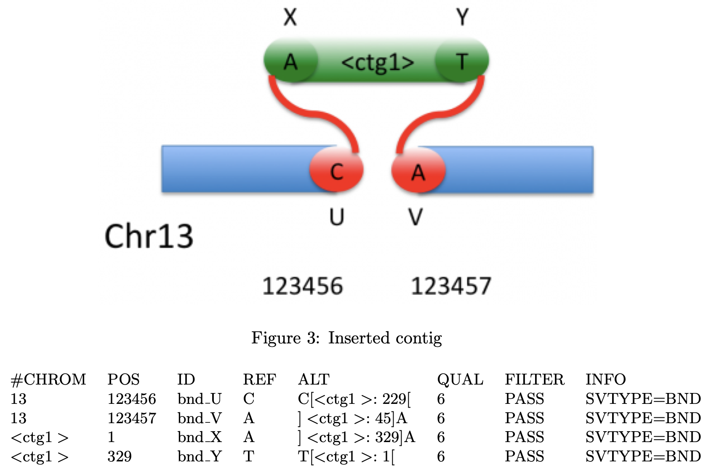

Additional Information
======================

.. contents::

Contributors
------------
Contributors, listed alphabetically:
Sarah Aufmkolk,
Alistair Boettiger,
Andrea Cosolo,
Rahi Navelkar,
Caterina Strambio De Castillia,
Steven Wang.

Example published datasets
--------------------------

4DN Data Portal
^^^^^^^^^^^^^^^
A collection of `Chromatin Tracing datasets <https://data.4dnucleome.org/resources/data-collections/chromatin-tracing-datasets>`_ presented in the 4DN standard FISH-Omics Format - Chromatin Tracing (FOF-CT) are available on the 4DN-Data Portal and were curated by the 4DN `Data Coordination and Integration Center (DCIC) team <https://data.4dnucleome.org/help/about/about-dcic>`_

Open Microscopy Environment Image Data Resource (OME-IDR)
^^^^^^^^^^^^^^^^^^^^^^^^^^^^^^^^^^^^^^^^^^^^^^^^^^^^^^^^^
Multiplexed FISH results data sets presented in the 4DN FOF-CT format are also available on the `OME-IDR <https://idr.openmicroscopy.org/>`_

* `Simultaneous visualization of DNA loci in single cells by combinatorial multi-color iFISH <http://idr.openmicroscopy.org/webclient/?show=project-2251>`_
* `In situ genome sequencing of human PGP1 fibroblasts <https://idr.openmicroscopy.org/webclient/?show=project-2051>`_

The Variant Call Format (VCF)
-----------------------------
The `Variant Call Format (VCF) <https://samtools.github.io/hts-specs/VCFv4.2.pdf>`_ is a standard tab-delimited text file format used in bioinformatics for storing gene sequence variations. The format was developed in 2010 for the 1000 Genomes Project and has since been used by other large-scale genotyping and DNA sequencing projects.

VCF is unambiguous, scalable and flexible, allowing extra information to be added to the info field. 

More information about how to prepare valid VCF files can be found `here <https://gatk.broadinstitute.org/hc/en-us/articles/360035531692-VCF-Variant-Call-Format>`_

  Figure 2: Schematic representation of the use of VCF to represent a genome variant containing an Inserted DNA fragement. Image from The Variant Call Format (VCF) Version 4.2 Specification, Dec 2013, available at https://cseweb.ucsd.edu/classes/sp16/cse182-a/notes/VCFv4.2.pdf

Older revision history
----------------------

.. note::
    Older versions of this document are available in the following Google Doc:
    https://docs.google.com/document/d/1z7rIYsQnbeS7y_SMuwoa8qsWKBD_BpV88vR79WiH_XI/edit?usp=sharing
    and Google Sheet: https://docs.google.com/spreadsheets/d/1GvqokS5w8Yw2tAngsqDC8YcLdRha5cGr/edit?usp=sharing&ouid=103316056144222958298&rtpof=true&sd=true

Feb 1, 2021 Alistair Boettiger

Feb 2, 2021 Bogdan Bintu, Steven Wang, Alistair Boettiger

Feb 8, 2021 Bogdan Bintu, Steven Wang, Alistair Boettiger

Feb 9, 2021 Steven Wang, Andrea Cosolo, Andrew Schroeder, Alistair Boettiger

Feb 12, 2021 Alistair

Feb 26, 2021 Caterina Strambio De Castillia

July 6, 2021 Alistair, Andrea

Aug, 2021, Sarah + Alistair

Sept 10, 2021 Alistair

Sept 16, 2021 Sarah (addition of SMLM data example #3 and #4)

October 18-29, 2021 Caterina (various comments and changes)

October 25, 2021 Discussion between Alistair and Caterina to address
several comments/issues. The main clarification point was that this
format is used specifically to define Chromatin Tracing results. This is
a subtype of a more generic FISH Omics Format. Other subtypes will be
defined ASAP.

November, 2021 Caterina (various comments and changes)

February 9, 2022 Caterina and Andrea: Change name and description for
tables #4 and #5 and add Table# to table header.

4DN Experimental and Microscopy Metadata
----------------------------------------
-  Project =
-  Center =
-  Lab =
-  Experiment protocol description =
-  Date collected =
-  Date submitted =
-  Experiment Type = FISH Omics - Chromatin Tracing
-  Experiment Set Type = Replicate
-  Organism = D. melanogaster
-  Biosource Type = tissue culture cell line
-  Biosource = IMR90
-  Modification Type = none
-  Treatment Type = none
-  Microscopy Metadata (including Provenance and Quality Control)
   conforming to 4DN-BINA-OME data model
-  Browsable probe map, (bed file, see example)
-  Probe sequences, (fasta file, see example)

Useful information
------------------

OME-NGFF and OME-Zarr
^^^^^^^^^^^^^^^^^^^^^
-  https://www.biorxiv.org/content/10.1101/2021.03.31.437929v4
-  https://zarr.readthedocs.io/en/stable/

Browsable probe map, example bed file
^^^^^^^^^^^^^^^^^^^^^^^^^^^^^^^^^^^^^

.. code::

  track name="AllRegions" description="mm10 AllRegions" visibility=1 itemRgb="On"
  chr12 113100000 113130000 IgH_001 1 + 113100000 113130000 255,0,0
  chr12 113130001 113160001 IgH_002 1 + 113130001 113160001 255,14,0
  chr12 113160002 113190002 IgH_003 1 + 113160002 113190002 255,28,0
  chr12 113190003 113220003 IgH_004 1 + 113190003 113220003 255,42,0
  ...

Probe sequence, example fasta file
^^^^^^^^^^^^^^^^^^^^^^^^^^^^^^^^^^

.. code::

  >FwdPrimer01__BarcodeName__SecondBarcodeName__probeTargetName_p001__RevPrimer01
  GCGGGACGTAAGGGCAACCGcatcaacgccacgatcagctGCTATCGTTCGTTCGAGGCCaggcaattcgagtggcgccctcgaagacgtctcgcaccttCCGTTCTGAGGGTTGCCGTG
  >FwdPrimer01__BarcodeName__SecondBarcodeName__probeTargetName_p002__RevPrimer01
  GCGGGACGTAAGGGCAACCGcatcaacgccacgatcagctGCTATCGTTCGTTCGAGGCCagactttggaagccaccctcattgattgctcgtgctccatCCGTTCTGAGGGTTGCCGTG
  ...

